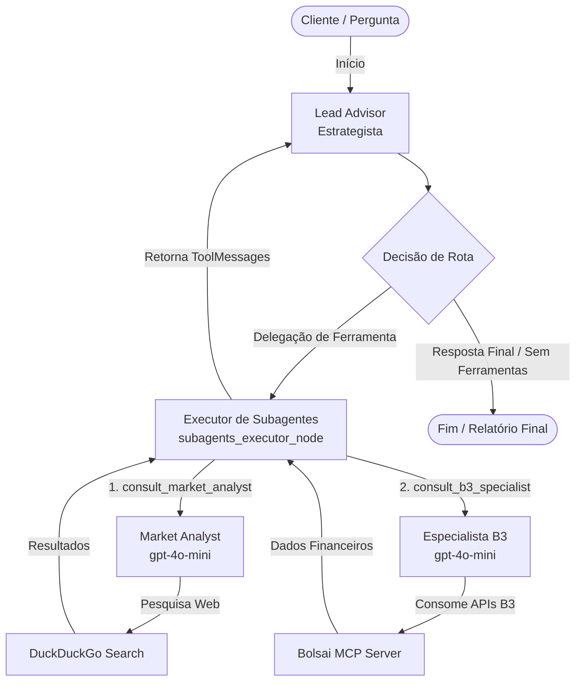

# Consultor Financeiro Inteligente - Quantum Finance

Este repositório contém a implementação de um **Consultor Financeiro Inteligente baseado em Inteligência Artificial Agêntica**. O sistema utiliza uma arquitetura multiagente com o [LangGraph](https://github.com/langchain-ai/langgraph) e obtém dados oficiais da B3 (bolsa de valores brasileira) em tempo real por meio do protocolo **MCP (Model Context Protocol)**, consumindo as APIs do serviço [Bolsai](https://usebolsai.com).

A implementação principal está disponível nos arquivos:
- [consultor_financeiro.ipynb](GitHub/Grupo_2_atividades/Fluxo_rag_mcp_b3/consultor_financeiro.ipynb) (Notebook interativo de desenvolvimento e execução)
- [test_flow.py](GitHub/Grupo_2_atividades/Fluxo_rag_mcp_b3/test_flow.py) (Script Python estruturado para execução e depuração via terminal)
- [README_ERROS_E_CORRECOES.md](GitHub/Grupo_2_atividades/Fluxo_rag_mcp_b3/README_ERROS_E_CORRECOES.md) (Histórico de problemas e soluções de infraestrutura)

---

## 1. Arquitetura Multiagente (LangGraph)

O sistema adota uma estrutura orquestrada onde um agente central (**Lead Advisor**) coordena o fluxo de conversa e delega tarefas específicas a dois subagentes especialistas de acordo com as necessidades do cliente.



### Agentes Especializados

1. **Lead Advisor (Estrategista Financeiro):**
   - **Modelo:** OpenAI `gpt-4o` (temperature: 0.2) para maximizar a capacidade de julgamento, síntese e conformidade.
   - **Função:** Atua como o ponto focal do cliente. Analisa o perfil do usuário (ex: Arrojado, Conservador) e os objetivos para planejar a busca de dados ou fornecer as recomendações consolidadas.
2. **Market Analyst (Pesquisador de Conceitos):**
   - **Modelo:** OpenAI `gpt-4o-mini` (temperature: 0.0) para rapidez e eficiência.
   - **Função:** Explica termos e conceitos financeiros (ex: como funciona LCI, LCA, Selic) fazendo buscas em tempo real na internet.
3. **Agente B3 (Especialista de Dados de Mercado):**
   - **Modelo:** OpenAI `gpt-4o-mini` (temperature: 0.0) para precisão na extração de parâmetros.
   - **Função:** Consulta cotações, múltiplos fundamentalistas, históricos de dividendos e dados macroeconômicos em tempo real diretamente da bolsa brasileira usando o protocolo MCP.

---

## 2. Estado do Grafo e Gestão de Mensagens

O estado do sistema é modelado pela classe [AgentState] que herda de `TypedDict`:

```python
class AgentState(TypedDict):
    messages: Annotated[List[BaseMessage], add_messages]
    user_profile: Dict[str, Any]
```

- **`messages`**: Histórico completo de interações (Humano, AI e Mensagens de Ferramentas). A anotação `add_messages` atua como um *reducer* que anexa novas mensagens ao invés de sobrescrever o estado, permitindo ao LangGraph manter o contexto completo da conversação.
- **`user_profile`**: Dicionário contendo os dados cadastrais do cliente (Nome, Perfil de Risco, Objetivo e Horizonte de Investimento).

---

## 3. Fluxo de Ferramentas (Tools)

O sistema utiliza dois níveis de ferramentas: ferramentas de **delegação** utilizadas pelo Lead Advisor e ferramentas de **infraestrutura** executadas pelos subagentes.

### Ferramentas de Delegação (Lead Advisor)

O `advisor_model` possui acesso exclusivo a estas ferramentas para acionar os nós de execução secundários:

* **[consult_market_analyst]  Delega uma pesquisa ou esclarecimento teórico sobre conceitos e regulação do mercado financeiro para o Market Analyst.
* **[consult_b3_specialist] Delega uma pesquisa quantitativa (dados de cotações, dividendos ou múltiplos fundamentalistas reais) para o Especialista B3.

### Ferramentas de Infraestrutura (Subagentes)

#### Executadas pelo Market Analyst:
* **[search_financial_concept] Executa pesquisas na Web usando o `DuckDuckGoSearchRun` para prover explicações e definições didáticas e atualizadas.

#### Executadas pelo Agente B3 (Bolsai MCP):
As seguintes ferramentas conectam-se ao servidor MCP `bolsai-mcp` via subprocesso stdio persistente controlado pela classe [BolsaiMCPClient]

1. **[get_stock_quote] Obtém preço atual, variação percentual diária e volume financeiro de ações ou FIIs na B3.
2. **[get_fundamentals] Consulta múltiplos de valuation e rentabilidade (ex: P/L, P/VP, ROE, Margem Líquida e Dívida Líquida/EBITDA).
3. **[get_dividends] Busca o Dividend Yield e o histórico recente de pagamentos/provisões do ticker indicado.
4. **[get_macro_data] Acessa dados macroeconômicos vigentes no Brasil (ex: taxa Selic, CDI acumulado, IPCA recente ou cotação do Dólar Comercial `usdbrl`).
5. **[compare_stocks] Gera uma tabela comparativa horizontal de indicadores fundamentalistas para até 5 ações.
6. **[get_fii_data] Retorna dados de fundos imobiliários, incluindo P/VP, vacância física/financeira e segmento (papel, tijolo, híbrido).
7. **[screen_stocks] Filtra ações listadas que atendem aos limites informados de múltiplos e setor.

---

## 4. Engenharia de Prompts

Os prompts são cruciais para orientar a coordenação e evitar a alucinação de dados numéricos voláteis:

### Prompt do Lead Advisor (`ADVISOR_SYSTEM_PROMPT`)
```text
Você é o Lead Advisor (Estrategista Financeiro) da Quantum Finance.
Seu papel é receber as dúvidas do cliente, entender o perfil dele, planejar a busca de dados reais e delegar tarefas para seus subagentes usando as ferramentas:
- 'consult_market_analyst' para dúvidas teóricas ou conceitos.
- 'consult_b3_specialist' para dados de mercado, cotações e múltiplos da B3.

Perfil do Cliente Atual:
{user_profile}

Diretrizes:
1. Nunca tente chutar ou alucinar cotações e múltiplos. Sempre chame o consult_b3_specialist.
2. Quando tiver todos os dados necessários reunidos, elabore um relatório final com a recomendação de alocação personalizada, justificando cada indicação de acordo com o perfil do cliente e os múltiplos da B3 de 2026 obtidos.
```

### Prompt do Market Analyst (`analyst_system`)
```text
Você é o Agente Pesquisador (Market Analyst). Sua tarefa é explicar de forma didática conceitos financeiros.
Use a busca na internet para responder.
```

### Prompt do Especialista B3 (`b3_system`)
```text
Você é o Agente de Dados B3. Sua tarefa é extrair múltiplos e cotações da B3.
```

---

## 5. Implementação Técnica do Fluxo de Trabalho (LangGraph)

### Nós do Grafo (Nodes)

1. **[lead_advisor_node]:**
   Injeta o perfil do cliente no template do prompt principal do Lead Advisor, anexa o histórico do chat (`state["messages"]`) e chama o modelo de linguagem GPT-4o.
2. **[subagents_executor_node]**:
   Analisa se a última resposta gerada pelo Lead Advisor contém chamadas de ferramentas de delegação (`tool_calls`). Esse nó executa um loop ReAct isolado para cada subagente.
   - **Importante:** Cada subagente funciona em seu próprio ciclo interno de decisões de ferramentas (ReAct). O executor captura o retorno textual final e gera uma `ToolMessage` correspondente para restabelecer a ordem lógica de mensagens da OpenAI.

### Arestas Condicionais (Conditional Edges)

* **[route_after_advisor]**
  Após a execução do Lead Advisor, a rota verifica o retorno:
  - Se houver `tool_calls` pendentes, direciona o fluxo para o nó `subagents_executor`.
  - Se não houver chamadas pendentes (o Lead Advisor gerou a recomendação final de investimento), direciona o fluxo para o fim do grafo (`END`).

### Evitando Erros de Histórico da OpenAI (HTTP 400)
Para evitar que a API do GPT lance erros de requisição inválida devido à falta de correspondência entre chamadas de ferramenta e suas respostas, o fluxo garante que:
- O estado utilize o reducer `add_messages` para não corromper o histórico temporal.
- Todas as requisições geradas no Lead Advisor (`consult_market_analyst` e `consult_b3_specialist`) recebam respostas sob o formato de `ToolMessage` contendo exatamente o `tool_call_id` original.

---

## 6. Configuração e Instalação

### Pré-requisitos

1. **Python 3.10+** instalado.
2. Gerenciador de pacotes **uv** instalado (necessário para o Bolsai MCP rodar isoladamente através do comando `uvx`).
3. Chave de API da **OpenAI**.
4. Token de acesso da **Bolsai** (obtenha gratuitamente criando uma conta em [usebolsai.com](https://usebolsai.com)).

### Instalação de Dependências

Instale os pacotes principais requeridos no ambiente virtual:
```bash
pip install langchain langchain-openai langgraph mcp duckduckgo-search nest-asyncio pandas requests pywin32
```

### Configuração de Variáveis de Ambiente

Configure as credenciais no seu sistema ou defina-as diretamente no script/notebook:
```python
import os

os.environ["OPENAI_API_KEY"] = "SUA-CHAVE-OPENAI"
os.environ["BOLSAI_API_KEY"] = "SUA-CHAVE-BOLSAI"
```

---

## 7. Como Executar

### Opção A: Execução via Jupyter Notebook
Abra o arquivo [consultor_financeiro.ipynb] em seu ambiente Jupyter e execute as células sequencialmente. A função `start_chat()` iniciará uma interface de chat interativo direto pelo console do notebook.

### Opção B: Execução via Terminal (Script de Teste)
Para rodar a simulação automática e verificar o encadeamento de chamadas e retornos entre o Lead Advisor e os subagentes, execute:
```bash
python test_flow.py
```
Este script testa dois turnos de conversa:
1. Consulta de comparação fundamentalista entre WEGE3 e ITUB4 contra a taxa Selic para o perfil *Arrojado*.
2. Modificação dinâmica do perfil para *Conservador*, ativando a memória conversacional e a retenção de dados históricos.
