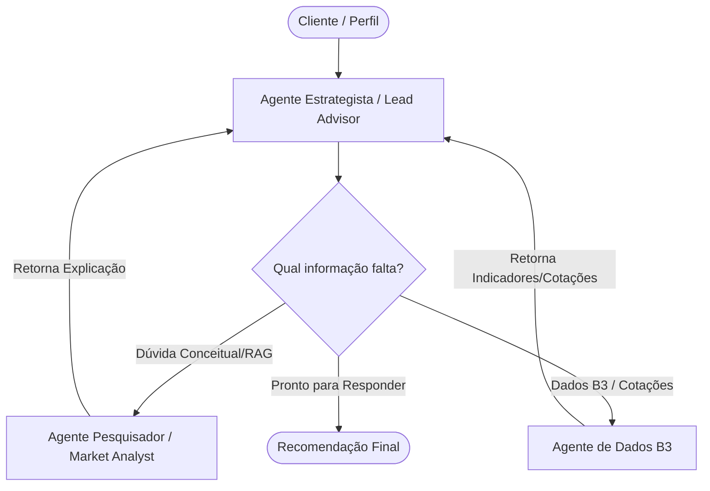

# Planejamento do Projeto: Consultor Financeiro Inteligente (Quantum Finance)

Este documento descreve a arquitetura proposta, o fluxo do projeto, a comparação de tecnologias e os modelos recomendados para o desenvolvimento do sistema de IA Agêntica para a **Quantum Finance**.

---

## 1. Visão Geral e Requisitos do Projeto

O objetivo é criar um consultor financeiro multiagente capaz de responder a consultas financeiras de clientes de forma confiável, combinando:
1. **Conceitos Financeiros (Pesquisador):** Explicação de produtos como CDB, LCI, LCA, Tesouro Direto e FIIs.
2. **Dados da B3 em Tempo Real (Agente B3):** Acesso a cotações, múltiplos fundamentalistas, dividendos e indicadores macroeconômicos.
3. **Orquestração Inteligente (Estrategista):** Consolidação dos dados para gerar uma recomendação personalizada de acordo com o perfil do investidor.

---

## 2. Arquitetura Multiagente Proposta (LangGraph)

Propomos o uso do **LangGraph** para a orquestração do fluxo. O LangGraph gerencia estados compartilhados e permite definir um grafo direcionado claro para a comunicação entre os agentes.

### Componentes dos Agentes:
1. **Agente Estrategista (Lead Advisor):**
   * **Papel:** O cérebro do sistema. Avalia a entrada do usuário, o perfil do cliente e coordena as chamadas aos agentes especialistas.
   * **Fluxo:** Recebe a pergunta $\rightarrow$ planeja a busca de informações $\rightarrow$ delega tarefas $\rightarrow$ consolida respostas $\rightarrow$ gera o relatório final.
2. **Agente Pesquisador (Market Analyst):**
   * **Papel:** Explicar conceitos e produtos de renda fixa e variável.
   * **Implementação:** Pode ser equipado com uma base de conhecimento RAG (Retrieval-Augmented Generation) contendo cartilhas de investimento ou acesso a uma ferramenta de busca na web.
3. **Agente de Dados B3:**
   * **Papel:** Especialista em buscar cotações e indicadores fundamentais diretamente da bolsa brasileira.
   * **Implementação:** Equipado com as ferramentas expostas pelo servidor MCP da **Bolsai**.

---

## 3. Integração com a B3 via Bolsai MCP

Para obter dados da B3 de 2026, utilizaremos o servidor MCP da **Bolsai** (`bolsai-mcp`). Há duas abordagens para implementar essa integração em Python dentro do Jupyter Notebook:

### Abordagem A: Cliente MCP Nativo em Python (Conexão stdio)
Instalamos o SDK do MCP (`mcp`) e instanciamos um subprocesso que executa `uvx bolsai-mcp`.
* *Vantagem:* Uso estrito e correto do protocolo MCP.
* *Desvantagem:* Requer gerenciamento de eventos assíncronos no Jupyter Notebook (`asyncio`), o que pode tornar o código do notebook um pouco complexo para depuração.

### Abordagem B: Integração Direta via API REST da Bolsai (Recomendada para Notebooks)
Como o servidor MCP da Bolsai consome a API REST pública `https://api.usebolsai.com/`, podemos criar funções Python simples que fazem requisições `requests` diretas com a `BOLSAI_API_KEY`.
* *Vantagem:* Código extremamente simples, limpo, fácil de ler, depurar e documentar no Jupyter Notebook.
* *Desvantagem:* Não usa o protocolo MCP bruto sob stdio, mas atinge exatamente o mesmo resultado final de dados.

---

## 4. Análise Comparativa: LangGraph vs. Google Agent SDK (ADK)

Embora o slide 8 recomende o uso do Google ADK, analisamos as duas alternativas para o seu caso de uso:

| Critério | LangGraph + LangChain (Recomendado) | Google Agent SDK (ADK) |
| :--- | :--- | :--- |
| **Integração com OpenAI** | **Excelente (Nativa).** Suporte completo a tool calling estruturado, streaming e histórico com modelos GPT. | **Limitada.** Focado principalmente na infraestrutura do ecossistema Google Cloud / Gemini. |
| **Controle de Fluxo** | **Grafo de Estados (Altamente controlável).** Perfeito para garantir que o Estrategista decida a ordem e repita se faltar dados. | Baseado em chat loops lineares ou hierárquicos predefinidos de forma mais rígida. |
| **Execução em Notebook** | **Muito amigável.** Fácil de desenhar o grafo visualmente no notebook e rodar interativamente. | Projetado para rodar como microsserviço ou aplicações estruturadas em arquivos `.py`. |
| **Comunidade e Exemplos** | Gigante, com milhares de exemplos de padrões multiagente. | Mais recente, focado em laboratórios de Cloud Boost. |

**Veredito:** Para um projeto que utiliza a API da **OpenAI** e será entregue em um **Jupyter Notebook**, o **LangGraph** é significativamente superior e facilitará o desenvolvimento do seu grupo.

---

## 5. Modelos Propostos (OpenAI)

Sugerimos os seguintes modelos para garantir custo-benefício e excelente raciocínio:

*   **`gpt-4o`:** Utilizado para o **Lead Advisor (Estrategista)**. Por ser o agente que consolida e decide o fluxo de raciocínio, precisa da melhor capacidade de síntese e julgamento.
*   **`gpt-4o-mini`:** Utilizado para os subagentes (**Market Analyst** e **B3 Data Agent**). Oferece latência extremamente baixa e custo reduzido, sendo excelente para tarefas focadas (como extração de parâmetros de ferramentas e síntese de buscas simples).

---

## 6. Proposta de Estrutura do Jupyter Notebook

O notebook `consultor_financeiro.ipynb` será organizado da seguinte forma:

1. **Configuração de Ambiente:** Instalação das bibliotecas (`langchain`, `langgraph`, `langchain-openai`, `requests` ou `mcp`).
2. **Autenticação:** Célula segura para inserção das chaves da OpenAI e da Bolsai (via `getpass`).
3. **Ferramentas de Dados (Tools):** Implementação das chamadas de API (Cotações, Fundamentos, Dividendos, Macro).
4. **Agente Pesquisador (RAG/Busca):** Configuração de busca conceitual para renda fixa/FIIs.
5. **Definição do Grafo do LangGraph:**
   * Definição do `State` do agente (histórico de mensagens, dados coletados, perfil do cliente).
   * Nós (*nodes*) para o Estrategista, Analista de Mercado e Especialista B3.
   * Arestas (*edges*) condicionais para tomada de decisão.
6. **Interface de Teste:** Execução de consultas financeiras reais simulando diferentes perfis de investidores (conservador, moderado, arrojado).

---

## 7. Sugestões de Abordagens Alternativas

Se você quiser explorar outras abordagens além de LangGraph, apresentamos duas alternativas:

1. **CrewAI (Focado em Processos de Equipe):**
   * *O que é:* Um framework de alto nível construído sobre LangChain.
   * *Vantagem:* Extremamente simples de configurar agentes com papéis (*roles*), objetivos (*goals*) e ferramentas (*tools*). O fluxo de trabalho hierárquico ou sequencial é configurado em poucas linhas de código.
   * *Desvantagem:* Menos controle detalhado sobre o fluxo lógico de decisão se comparado ao LangGraph.
2. **Autogen (Microsoft):**
   * *O que é:* Focado em conversas dinâmicas e autónomas entre agentes.
   * *Vantagem:* Suporta conversação de múltiplos turnos com participação humana no meio do fluxo de forma nativa.
   * *Desvantagem:* Pode ser imprevisível e consumir muitos tokens devido à autonomia dos agentes.
