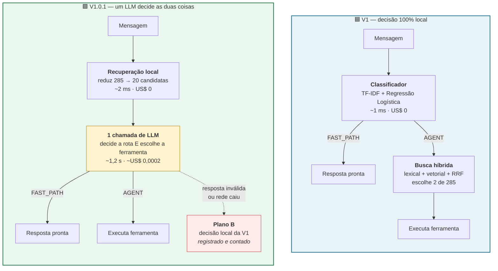
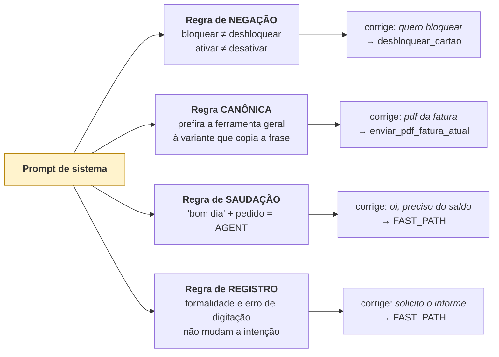
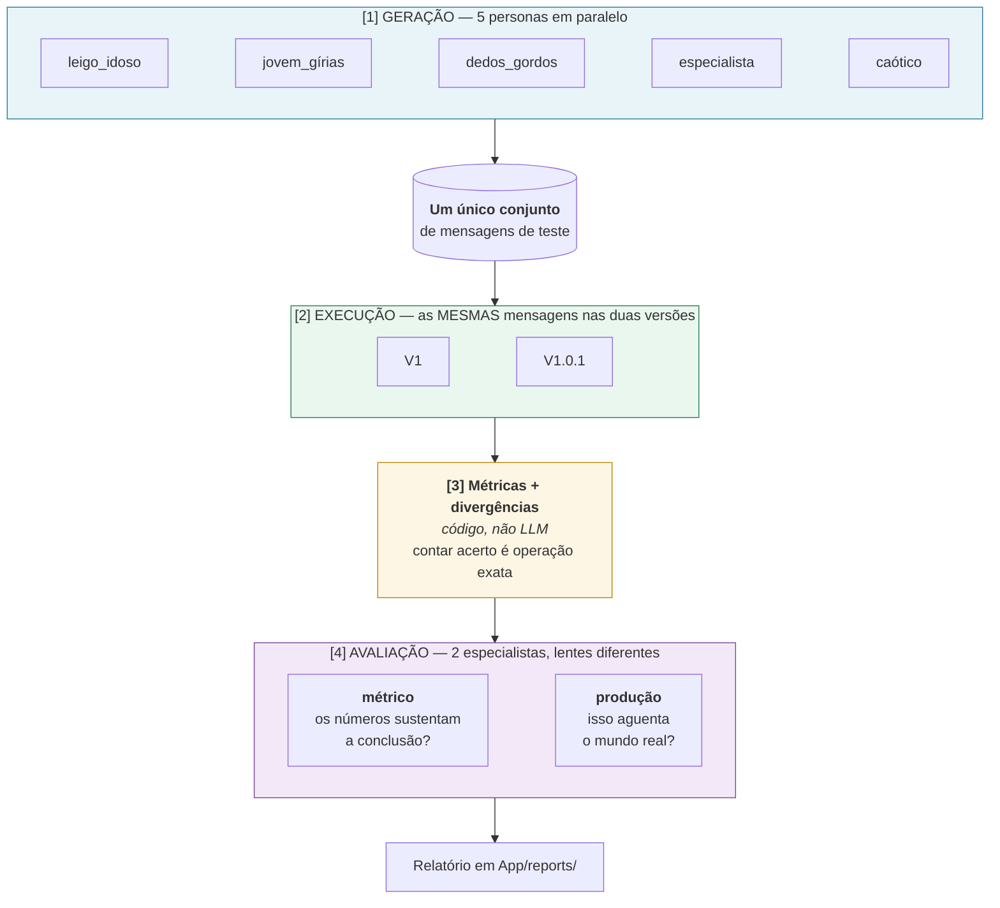

# Arquitetura — V1.0.1 (Agente Orquestrador)

> **O que é este documento:** como a V1.0.1 é montada, o que mudou em relação à V1, e como
> as duas são comparadas.
> **Documentos irmãos:** [V1_0_1_DECISIONS.md](V1_0_1_DECISIONS.md) (o porquê de cada escolha) ·
> [ARCHITECTURE.md](ARCHITECTURE.md) (a V1) · [V1_DESCOBERTAS.md](V1_DESCOBERTAS.md) (os bugs que motivaram esta versão)

---

## 1. O que muda, em uma imagem



**O que NÃO muda:** o estágio de recuperação local continua existindo nas duas. O LLM da
V1.0.1 **nunca vê as 285 ferramentas** — ele escolhe entre 20. Isso preserva a tese central do
projeto: o componente barato faz a triagem, o caro faz o julgamento fino.

---

## 2. Por que uma chamada e não duas

O caminho óbvio seria: uma chamada para decidir a rota, outra para escolher a ferramenta.
Rejeitamos, e o motivo é como o custo de um LLM se divide:

| Componente | O que domina |
|---|---|
| Tokens | o **preço em dólares** |
| Ida e volta de rede | a **latência** (~200–800 ms, mesmo para 5 tokens de resposta) |

Duas chamadas pagariam **dois** tempos de rede. Como as duas decisões dependem da mesma leitura
da mensagem, separá-las gastaria o dobro da latência sem ganhar informação.

Isso só é possível porque a busca local custa ~2 ms e zero dólar — então rodamos ela **antes**
de saber a rota, e mandamos as candidatas junto no mesmo prompt. Se a resposta for FAST_PATH,
descartamos as candidatas e não perdemos nada relevante.

---

## 3. O prompt carrega as duas armadilhas conhecidas

Os testes da V1 revelaram dois modos de falha. O prompt trata os dois de forma explícita,
porque um LLM genérico cairia nos mesmos:



Cada regra existe por causa de um bug **medido** na V1, não por precaução genérica.

---

## 4. A camada de testes com subagentes



### As quatro decisões de método embutidas nesse desenho

| Decisão | Por quê |
|---|---|
| **As personas geram UMA vez** | Se cada versão fosse testada com mensagens diferentes, a diferença de acerto poderia vir do conjunto de mensagens em vez do sistema. Mesmas entradas = a única variável é a versão |
| **As métricas são código, não LLM** | Contar acerto é operação exata. Pedir a um LLM que calcule métricas introduz erro onde não precisa haver nenhum. LLM entra só onde há julgamento subjetivo |
| **5 personas com perfis fechados** | Um único agente gerando 300 mensagens produz 300 variações do mesmo registro — exatamente o ponto cego que derrubou a V1 |
| **2 avaliadores com lentes distintas** | Dois avaliadores idênticos dariam a mesma resposta duas vezes. As lentes cobrem as duas formas de uma decisão dar errado: os números mentem, ou o sistema quebra em produção |

### As 5 personas e o que cada uma expõe

| Persona | Escrita | Desempenho na V1 |
|---|---|---|
| `leigo_idoso` | indireta, sem jargão, com rodeio | 39% |
| `jovem_girias` | abreviação, gíria, sem pontuação | 54% ← o melhor |
| `dedos_gordos` | 2 a 4 erros de digitação por mensagem | 32% |
| `especialista_bancario` | jargão correto e formal | **25%** ← o pior |
| `caotico` | fora de escopo, adversarial, degenerado | robustez |

As duas **pontas** do espectro falharam mais. Não é coincidência: ambas se afastam do registro
médio dos 53 exemplos de treino, em direções opostas.

---

## 5. Estrutura de pastas (o que foi acrescentado)

```
Treinamento-case-router/App/
│
├── versions/                      🆕 as duas versões sob um contrato comum
│   ├── base.py                       BasePipeline + PipelineResult
│   ├── v1_classic.py                 V1: embrulha candidate_starter/
│   └── v1_0_1_orchestrator.py        V1.0.1: orquestrador + tabela de preços
│
├── agents/                        🆕 subagentes de TESTE (SDK da OpenAI)
│   ├── base.py                       Agent reutilizável + execução paralela
│   ├── personas.py                   as 5 personas
│   ├── evaluators.py                 os 2 avaliadores
│   └── run_suite.py                  orquestra as 4 etapas
│
├── eval/
│   └── model_bakeoff.py           🆕 comparativo de modelos candidatos
│
├── reports/                       🆕 saídas dos subagentes (versionadas)
│   ├── model_bakeoff.json
│   ├── dataset_personas.json
│   └── bateria_v1_x_v101.json
│
└── core/, notebooks/                 (inalterados da V1)
```

### Por que `versions/` embrulha em vez de alterar

`candidate_starter/` é o entregável do case, **já publicado no GitHub**. Alterá-lo para
acomodar a comparação misturaria duas preocupações e quebraria a promessa de que aquele código
roda com o `requirements.txt` original, sem rede.

`v1_classic.py` não reimplementa nada — apenas adapta as classes existentes ao contrato comum.

---

## 6. Como rodar

Os comandos abaixo rodam a partir de `Treinamento-case-router/`.

**Comparativo de modelos candidatos:**

```bash
python -m App.eval.model_bakeoff
```

**Bateria completa (personas geram → as versões rodam → avaliadores julgam):**

```bash
python -m App.agents.run_suite --gerar-dataset --n-por-persona 30
```

**Rodada padrão, reaproveitando o conjunto já gerado.** É o modo normal: gerar mensagens novas
troca o conjunto de teste e quebra a comparação com as rodadas anteriores, por isso reaproveitar
é o default e gerar é que precisa de flag explícita.

```bash
python -m App.agents.run_suite
```

> ⚠️ Tudo aqui precisa de `OPENAI_API_KEY` em `App/.env`. O núcleo do case em
> `candidate_starter/` continua rodando offline, sem nenhuma dessas dependências.
