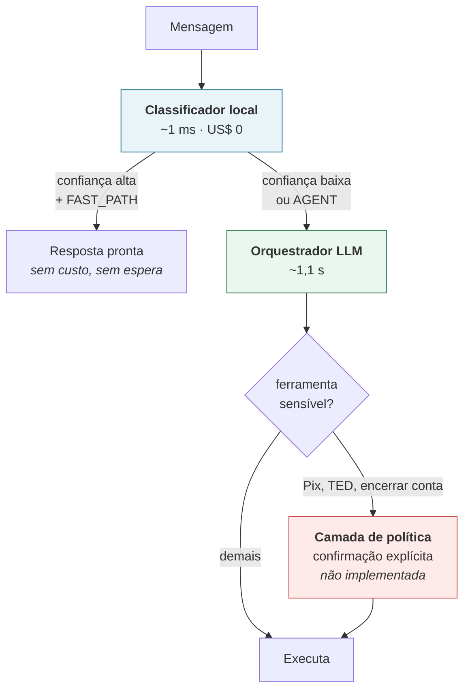

# V1 × V1.0.1 — Resultado da Comparação

**Data:** 14/08/2026 · **Experimento:** 180 mensagens, as mesmas nas duas versões
**Documentos irmãos:** [V1_0_1_ARCHITECTURE.md](../V1_0_1_ARCHITECTURE.md) · [V1_0_1_DECISIONS.md](../V1_0_1_DECISIONS.md) · [V1_DESCOBERTAS.md](../V1_DESCOBERTAS.md)

> ⚠️ **Números desta rodada são históricos** — por isso este arquivo está em `docs/historico/`.
> Foram medidos **antes** da correção do prior de
> generalidade ([ADR-07](../DECISIONS.md#adr-07)), que trocou o sinal de especificidade e o valor
> de `λ`. Como as versões compartilham o mesmo estágio de recuperação, todas melhoraram depois:
> a V1 subiu de 75% para 85% de Hit@2 no conjunto oficial, e a V1.0.1 de 85% para 95%.
>
> **Para os números atuais, ver [V1_0_2_RESULTADO.md](../V1_0_2_RESULTADO.md).**
>
> Este documento é mantido como está porque o registro do experimento — o método, as ressalvas
> e os pareceres — continua válido, e reescrever números de uma execução que não aconteceu seria
> falsear o histórico.

> Escrito para ser entendido sem conhecimento prévio de IA. Termos técnicos estão no
> [glossário do V1_DESCOBERTAS.md](../V1_DESCOBERTAS.md#glossário).

---

## 1. O que foi comparado

| | V1 | V1.0.1 |
|---|---|---|
| Quem decide a rota | classificador treinado (scikit-learn) | um LLM |
| Quem escolhe a ferramenta | busca por similaridade | o mesmo LLM, na mesma chamada |
| Custo da decisão | ~US$ 0 | ~US$ 0,0002 |
| Modelo | — | `gpt-5.6-luna`, `reasoning_effort: none` |

O que **não** mudou: as duas usam o mesmo estágio local que reduz 285 ferramentas para as
candidatas. O LLM da V1.0.1 nunca vê o catálogo inteiro.

---

## 2. Os números

### Dataset oficial — 30 mensagens, rótulos escritos por humano

| Versão | Acerto de rota | Precision@2 | Latência p50 |
|---|---|---|---|
| V1 | 100% | 75% | 3 ms |
| **V1.0.1** | 100% | **85%** | 1.142 ms |

### Conjunto das personas — 150 mensagens geradas por 5 agentes

| Versão | Acerto de rota | Precision@2 | Latência p50 |
|---|---|---|---|
| V1 | 84,0% | 54,9% | 412 ms |
| **V1.0.1** | **98,0%** | **89,4%** | 1.494 ms |

### O número mais decisivo: divergências

Das 180 mensagens, as duas versões discordaram em **87**:

```
Só a V1.0.1 acertou ........ 50
Só a V1 acertou ............  4
```

**Proporção de 12,5 para 1.** Não é uma versão trocando acertos por erros — é ganho quase
unilateral.

### Por persona (Precision@2)

| Persona | V1 | V1.0.1 | Ganho |
|---|---|---|---|
| `leigo_idoso` | 36% | 72% | **dobrou** |
| `dedos_gordos` | 58% | **100%** | +42 pts |
| `especialista_bancario` | 68% | 96% | +28 pts |
| `jovem_girias` | 60% | 88% | +28 pts |
| `caotico` | 50% | 93% | +43 pts |

O ganho aparece em **todas as cinco**, não numa só. Isso importa: se aparecesse em uma
persona apenas, seria suspeita de ruído amostral.

---

## 3. O que os dois avaliadores especialistas disseram

**Nenhum dos dois recomendou adotar a V1.0.1 como está.**

### `avaliador_producao` → recomenda **híbrido** (confiança 87%)

| Dimensão | Nota |
|---|---|
| Segurança e controle | **3/10** |
| Resiliência e disponibilidade | 4/10 |
| Latência | 5/10 |
| Operação e evolução | 5/10 |
| Custo em escala | 7/10 |

**Achado crítico — "O LLM não pode autorizar operações financeiras".** A mensagem do cliente,
que é conteúdo não confiável, influencia um LLM que seleciona ferramentas bancárias. Nenhuma
métrica apresentada comprova segurança. **É a mesma falha que o teste de personas da V1
encontrou ontem** — e ela não foi corrigida: continua não existindo camada de política entre
*escolher* e *executar* a ferramenta.

Outros achados de gravidade alta: a cauda de latência (p95 ~2,2 s) entra no caminho crítico; o
plano B preserva disponibilidade mas devolve os bugs da V1; a recuperação para 20 candidatas é
um teto silencioso.

### `avaliador_metrico` → recomenda **inconclusivo** (confiança 91%)

| Dimensão | Nota |
|---|---|
| Controle de vazamento e viés | **2/10** |
| Validade dos rótulos | 3/10 |
| Integridade das métricas | 3/10 |
| Poder estatístico | 4/10 |
| Justiça da comparação | 7/10 |

**Achado crítico — "Nenhum conjunto é simultaneamente grande, humano e livre de contaminação".**
E ele está certo:

```
Dataset oficial ..... humano ✓   limpo ✗ (40% vem do treino)   grande ✗ (n=30)
Personas ............ humano ✗   limpo ✓                        grande ✓ (n=150)
```

Falta o conjunto que tem as três propriedades. Sem ele, a comparação não fecha.

**Um ponto onde a crítica não procede — e conferimos.** Ele apontou que "Precision@2 está
indefinida e pode estar inflada", suspeitando que fosse calculada só sobre mensagens que o
roteador já acertou. Fomos ao código e medimos:

```
Casos com ferramenta esperada .................... 113
Destes, o roteador da V1 mandou p/ FAST_PATH ......  16
Denominador usado no cálculo ..................... 113  ← inclui os 16 erros
```

A métrica **não** é condicional: erro de rota conta como erro de ferramenta. Se fosse
condicional, o P@2 da V1 subiria de 54,9% para 63,9% — artificialmente. É exatamente a armadilha
que documentamos na V1 e corrigimos aqui. **O avaliador estava certo em cobrar a fórmula** — ela
não estava no dossiê que ele recebeu. Falha de documentação, não de método.

---

## 4. Leitura honesta do resultado

### A favor da V1.0.1

1. **Ganha nos dois conjuntos**, inclusive no oficial — que tem 40% de vazamento **a favor da
   V1**. Vencer num conjunto enviesado contra você é mais significativo, não menos.
2. **12,5 acertos exclusivos para cada 1 perdido.** Não é troca, é ganho.
3. **Corrige 100% dos casos críticos** que a V1 erra (bloquear/desbloquear, registro formal,
   saudação, typo), onde a V1 acerta **zero**.
4. **O ganho é uniforme entre personas**, o que argumenta contra explicação por ruído.
5. **O custo ficou em ~4%**, não em ordens de grandeza.

### Contra

1. **Latência: 3 ms → 1.142 ms.** É o custo real, e é o que precisa de decisão humana.
2. **Dependência externa no caminho crítico**, com todos os modos de falha que implica.
3. **A vantagem grande está no conjunto de rótulos "prata"** — gerados por um modelo da OpenAI,
   assim como a V1.0.1. Viés compartilhado é uma explicação alternativa que não conseguimos
   descartar com os dados atuais.
4. **A falha de segurança segue aberta**, e ela independe de qual versão vence.

---

## 5. O que fazer — proposta, não decisão

Os dois avaliadores, por caminhos independentes, apontaram para o mesmo lugar: **híbrido**.

### Proposta: V1.0.2 em cascata



**Por que isso resolve as duas objeções.** Saudações e FAQ são a parte fácil e volumosa — o
classificador local resolve em 1 ms com alta confiança. O LLM entra só onde ele agrega. A
latência **média** cai muito, o custo cai, e a acurácia se mantém.

E a camada de política endereça o achado crítico de segurança, que nenhuma das duas versões
resolve hoje.

### O que precisa ser medido antes de qualquer decisão final

Ordenado por quanto muda a conclusão:

| # | Medição | Por quê |
|---|---|---|
| 1 | **Conjunto humano novo, maior e sem sobreposição** | É o achado crítico do avaliador métrico. Sem ele, nada fecha |
| 2 | **Sucesso ponta a ponta**: qual ferramenta foi de fato executada, com quais argumentos | Hoje paramos em "a ferramenta certa estava no top-2" — não é a mesma coisa que o cliente ser atendido |
| 3 | **Resistência a prompt injection** com ferramentas que movimentam dinheiro | Achado crítico do avaliador de produção |
| 4 | **Recall@20 da recuperação local** por persona e por idioma | É o teto silencioso de ambas |
| 5 | **Latência p95/p99 sob carga concorrente** | Medimos sequencial; produção é concorrente |
| 6 | **Concordância entre rótulos "prata" e humanos** | Quantifica o viés compartilhado em vez de só declará-lo |

---

## 6. Custo do experimento

| Item | Custo |
|---|---|
| 5 personas gerando 150 mensagens | US$ 0,52 |
| 2 avaliadores especialistas | US$ 0,24 |
| Execução das 180 mensagens nas duas versões | ~US$ 0,03 |
| **Total** | **~US$ 0,79** |

Menos de um dólar para produzir a comparação inteira, incluindo dois pareceres técnicos.

---

## Resumo em uma frase

> **A V1.0.1 ganha em todos os cortes medidos, com 12,5 acertos exclusivos para cada 1 perdido —
> mas os dois avaliadores convergiram em "não adote como está": falta um conjunto de teste
> humano e limpo, e falta a camada de política que impede um LLM de autorizar movimentação
> financeira. O caminho apontado pelos dois é o híbrido.**
