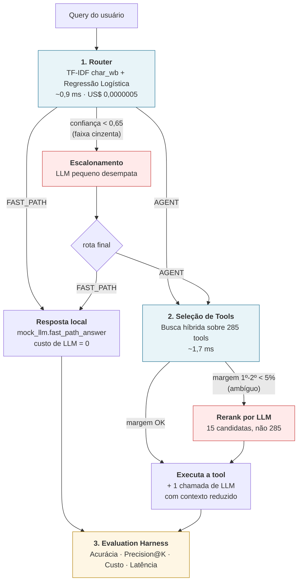
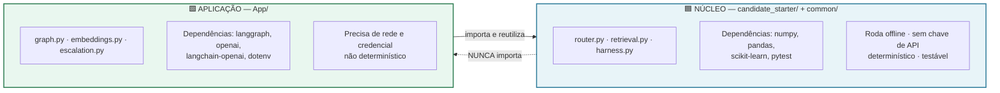
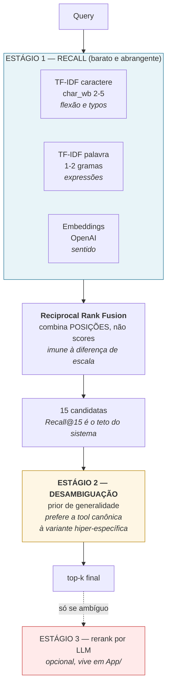
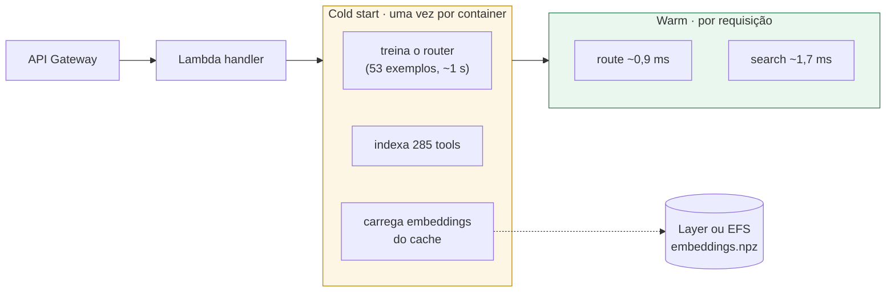

# Arquitetura — Cérebro de Roteamento

> Documento de arquitetura: **o que existe, onde mora e por que está separado assim**.
> Para o raciocínio por trás de cada escolha técnica, veja [DECISIONS.md](DECISIONS.md).

---

## 1. Visão geral do fluxo



Os blocos em **vermelho** são os únicos que gastam LLM antes da resposta — e ambos só
são alcançados por aresta condicional, quando o componente barato admite que não sabe.

---

## 2. As duas camadas e por que estão separadas



### Por que essa separação

| Motivo | O que garante na prática |
|---|---|
| **O avaliador precisa conseguir rodar** | `pip install -r requirements.txt` e `pytest` funcionam sem LangGraph, sem chave e sem internet. O `requirements.txt` original ficou **intocado** |
| **A premissa do case é custo** | Tudo que é caro, lento ou não determinístico fica fisicamente isolado numa camada opcional. Não há como uma dependência de LLM vazar para o caminho barato por descuido |
| **Falha isolada** | Se a API da OpenAI cair ou a chave expirar, o núcleo continua entregando resultado — degrada para modo lexical, não quebra |
| **Direção única de dependência** | `App/ → candidate_starter/`, nunca o contrário. O núcleo não sabe que a camada de aplicação existe |
| **Reuso sem duplicação** | O grafo LangGraph **consome** `QueryRouter` e `ToolRetriever` como nós. Não existe uma segunda implementação para manter em sincronia |
| **Caminho para o Lambda** | O deploy futuro empacota `candidate_starter/` + `App/core/`, deixando notebooks e avaliação de fora |

### O ponto de contato entre as camadas

A ligação é **um gancho de injeção de dependência**, não um import:

```python
# App/main.py — a camada de aplicação injeta o estágio vetorial
dense_provider = build_dense_provider(settings)   # None se não houver chave
retriever.set_dense_provider(dense_provider)      # o núcleo aceita None sem reclamar
retriever.fit(tools)
```

O núcleo declara o gancho e funciona sem ele. Quem tem a chave de API decide plugar.

---

## 3. Estrutura de pastas

```
case-agents/
│
├── candidate_starter/          🟦 ENTREGÁVEL DO CASE — núcleo puro
│   ├── router.py                  Pilar 1 · classificação de rota
│   ├── retrieval.py               Pilar 2 · busca híbrida em 2 estágios
│   ├── harness.py                 Pilar 3 · métricas e benchmark
│   ├── run_case.py                (original) orquestra e salva o relatório
│   └── tests/test_sanity.py       (original) testes de sanidade
│
├── common/                     ⬜ INTOCADO — contratos e mocks fornecidos
│   ├── interfaces.py              ABCs que router e retriever implementam
│   ├── schemas.py                 RouteResult, ToolMatch, RetrievalResult
│   ├── mock_llm.py                custos e latências simuladas
│   └── data_loader.py             leitura dos JSONs
│
├── data/                       ⬜ INTOCADO
│   ├── tools_registry.json        285 tools (com quase-duplicatas propositais)
│   ├── router_training_data.json  53 exemplos rotulados
│   └── eval_dataset.json          30 queries de avaliação
│
├── reports/candidate_report.json  📄 saída do harness (entregável nº2)
│
└── App/                        🟩 CAMADA DE APLICAÇÃO
    ├── ARCHITECTURE.md            este documento
    ├── DECISIONS.md               registro de decisões (o porquê de cada escolha)
    ├── .env.example               modelo de credenciais (versionado, sem valores)
    ├── .env                       credenciais reais (NUNCA versionado)
    ├── requirements-app.txt       dependências só desta camada
    ├── main.py                    entrypoint local · esqueleto do futuro Lambda
    │
    ├── core/
    │   ├── config.py              único lugar que lê variáveis de ambiente
    │   ├── embeddings.py          estágio vetorial + cache em disco
    │   ├── escalation.py          cascata: quando vale gastar um LLM
    │   └── graph.py               StateGraph do LangGraph
    │
    ├── eval/
    │   ├── generate_eval_set.py   amplia o conjunto de teste via LLM
    │   ├── judge.py               LLM-as-judge · Precision@K semântico
    │   ├── run_batch.py           executa lotes de mensagens pelo pipeline
    │   ├── model_bakeoff.py       compara modelos candidatos a orquestrador
    │   └── calibrar_cascata.py    calibra os limiares da V1.0.2
    │
    ├── notebooks/                 desenvolvimento passo a passo
    └── cache/                     embeddings persistidos (não versionado)
```

---

## 4. O Pilar 2 em detalhe (onde está a dificuldade real)



### O problema que o Estágio 2 ataca

O catálogo tem 285 tools com quase-duplicatas **propositais**. Para várias queries, a tool
mais parecida lexicalmente **não** é a correta:

| Query | Tool correta | Sem o prior | Com o prior |
|---|---|---|---|
| "Manda o pdf da minha fatura atual" | `consultar_fatura` | `enviar_pdf_fatura_atual` | ✅ corrigido |
| "Quero parcelar minha fatura em 3 vezes" | `parcelar_fatura` | `parcelar_fatura_numero_vezes_escolhido` | ✅ corrigido |
| "Preciso saber o saldo disponível pra pix" | `consultar_saldo` | `consultar_saldo_disponivel_pix` | ✅ corrigido |
| "Quanto eu tenho disponível na conta agora?" | `consultar_saldo` | `consultar_valor_disponivel_conta` | ❌ **ainda falha** |
| "Cobraram algo errado, quero o dinheiro de volta" | `estornar_transacao` | `reclamar_cobranca_errada...` | ❌ **ainda falha** |

O prior corrige **8 das 20** queries com ferramenta esperada, levando o Precision@2 de 0,45 a
0,85. **Três continuam falhando** — as duas acima e `"Preciso mudei de casa, como mudo o CEP?"`.

Os casos que sobram têm duas causas distintas, e nenhuma delas o prior resolve:

- **A isca também tem nome curto.** `consultar_valor_disponivel_conta` tem 4 tokens — não é
  longa o bastante para o prior derrubá-la.
- **Não há sobreposição de palavras.** Em "mudei de casa / CEP" → `alterar_endereco`, a palavra
  "endereço" simplesmente não aparece. Nenhum reordenamento recupera o que não entrou nas
  candidatas; isso é problema de **recall**, e é o que o estágio vetorial ataca.

Há testes dedicados a essas falhas conhecidas (`test_prior_nao_resolve_tudo`), para que elas
sejam documentadas em vez de virarem surpresa.

Efeito medido de cada camada da solução:

| Estratégia | Precision@2 |
|---|---|
| TF-IDF de palavra, similaridade pura | 0,25 |
| TF-IDF de caractere, similaridade pura | 0,35 |
| RRF(caractere + palavra) | 0,45 |
| **RRF + prior de generalidade** ← adotado | **0,85** |

---

## 5. Como rodar

**Núcleo (o que o avaliador roda) — sem chave, sem rede:**

```bash
pip install -r requirements.txt
```

```bash
python -m pytest candidate_starter/tests -v
```

```bash
python -m candidate_starter.run_case
```

**Camada de aplicação — com LangGraph e OpenAI:**

```bash
pip install -r App/requirements-app.txt
```

```bash
python -m App.main
```

Sem `OPENAI_API_KEY`, `App/main.py` roda igual, em modo lexical, e avisa no console.

---

## 6. Caminho para produção (AWS Lambda) — melhoria futura



`App/main.py:build_pipeline()` já isola o trabalho caro justamente para esse formato: em
Lambda ele sobe para o escopo do módulo, e só `run_query()` roda por invocação. **Não
implementado neste escopo** — registrado como próximo passo.
