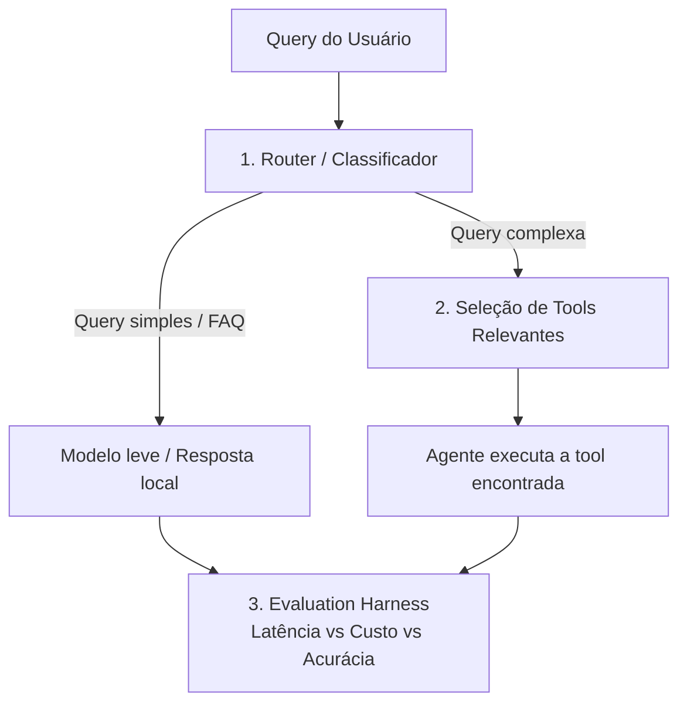

# Case Técnico — Router de Queries & Seleção de Tools

## Contexto

Você está construindo o "cérebro de roteamento" de um agente de atendimento (banco digital
fictício). Antes de qualquer chamada a um LLM caro, o sistema precisa decidir **o caminho mais
barato e rápido possível** para responder cada mensagem do usuário.

Este case tem requisitos claros, mas **a técnica/abordagem é escolha sua** — não há uma única
solução "certa" esperada. Justifique as decisões que tomar.



## O que você precisa implementar

### Pilar 1 — Router (`router.py`)
Um componente que decide, para cada `query`, se ela deve ir para:
- `FAST_PATH`: saudações, FAQ, perguntas genéricas → resposta local (`common/mock_llm.py`).
- `AGENT`: precisa de uma tool específica → vai para o Pilar 2.

Implemente `fit(texts, labels)` e `predict(query) -> RouteResult` (contrato em
`common/interfaces.py`). A técnica é livre. Treine com `data/router_training_data.json`.

### Pilar 2 — Seleção de Tools Relevantes (`retrieval.py`)
O catálogo de tools está em `data/tools_registry.json`. Passar todas as tools no prompt de
um LLM não escala (estoura o contexto, confunde o modelo, aumenta custo e latência).

**Requisito:** `search(query, k=2)` deve retornar as `k` tools mais relevantes do catálogo
para a query, antes de qualquer chamada ao LLM. A estratégia de seleção/ranking é livre —
só precisa ser justificável.

### Pilar 3 — Evaluation Harness (`harness.py`)
A orquestração do pipeline já está pronta. Falta implementar as métricas:
- Acurácia do Router + matriz de confusão.
- Precision@K do retriever (a tool certa estava no top-k?).
- % de economia de custo e de latência do pipeline "inteligente" vs. baseline (mandar tudo
  direto para o LLM caro, com todas as tools no prompt).

## Como rodar

```bash
pip install -r requirements.txt
python -m candidate_starter.run_case
pytest candidate_starter/tests -v
```

## Entregáveis

1. `router.py`, `retrieval.py`, `harness.py` implementados (os testes em `tests/` devem passar).
2. O relatório impresso/gerado por `run_case.py` (salvo em `reports/candidate_report.json`).
3. Um breve comentário (README ou PR) explicando as escolhas técnicas e trade-offs.

---
---

# Solução

## Resultado

| Métrica | Baseline ingênuo | Solução |
|---|---|---|
| Acurácia do Router | — | **100%** · IC 95%: 88,6%–100% |
| Precision@2 do Retriever | 25% | **85%** |
| Economia de custo | — | **77,8%** |
| Economia de latência | — | 97,7% · **65,3%** na comparação maçã-com-maçã |

```bash
pip install -r requirements.txt
python -m pytest candidate_starter/tests -v   # 55 testes
python -m candidate_starter.run_case
```

Roda offline, sem chave de API, sem dependência além do `requirements.txt` original.

## As três escolhas que definem a solução

**1. O router é um classificador local, não um LLM.** O enunciado pede para decidir o caminho
mais barato *antes* de chamar um LLM caro — usar um LLM nessa decisão seria o custo que ele
existe para evitar. E não havia ganho a capturar: TF-IDF de caractere + Regressão Logística
acerta 100% do conjunto, em ~1 ms.

**2. A dificuldade real do case está no Pilar 2.** O catálogo tem 285 tools com quase-duplicatas
propositais: para várias queries, a tool **mais parecida não é a correta**.

| Query | Esperado | O que a similaridade retorna |
|---|---|---|
| "Manda o pdf da minha fatura atual" | `consultar_fatura` | `enviar_pdf_fatura_atual` |
| "Quanto eu tenho disponível na conta agora?" | `consultar_saldo` | `consultar_valor_disponivel_conta` |

**3. A correção é um prior de generalidade**, que prefere a capacidade canônica à variante que
copia a frase do cliente. É o maior ganho isolado da solução:

| Estratégia | Precision@2 |
|---|---|
| TF-IDF de palavra, similaridade pura | 0,25 |
| TF-IDF de caractere, similaridade pura | 0,35 |
| Fusão dos dois por Reciprocal Rank Fusion | 0,45 |
| **+ prior de generalidade** | **0,85** |

**Testadas e descartadas, com números:** BM25 com normalização agressiva de comprimento (0,20 —
o parâmetro `b` normaliza saturação de frequência, não especificidade de conceito) e
clusterização de quase-duplicatas (0,60 — a transitividade encadeia grupos e derruba o
Recall@15 de 0,90 para 0,70).

## Ressalvas sobre os próprios números

Três vieses que **inflam o nosso resultado**, declarados porque omiti-los seria desonesto:

1. **A economia de latência obrigatória compara escopos diferentes** — no caminho inteligente o
   harness soma só router + retrieval; no baseline, soma a chamada de LLM. Por isso reportamos
   também os 65,3%.
2. **Precision@K é condicional ao acerto do router** — um router ruim pode *inflar* a métrica
   ao remover da conta os casos que errou. Daí o `end_to_end_success_rate`.
3. **40% do `eval_dataset.json` tem sobreposição alta com o treino** (3 são cópias literais).
   No subconjunto de 18 mensagens sem sobreposição, a acurácia se mantém em 100%.

## Documentação detalhada

| Documento | Conteúdo |
|---|---|
| [`App/DECISIONS.md`](App/DECISIONS.md) | O raciocínio por trás de cada escolha, com as alternativas descartadas |
| [`App/V1_DESCOBERTAS.md`](App/V1_DESCOBERTAS.md) | 20 bugs encontrados testando com personas de usuário, e o que continua aberto |
| [`App/ARCHITECTURE.md`](App/ARCHITECTURE.md) | Diagramas e a separação núcleo × aplicação |

**Além do escopo pedido:** o case foi usado como base para testar o roteamento com clientes
simulados e comparar arquiteturas. O achado principal — **85% no conjunto oficial contra 45,8%
com mensagens de clientes reais** — motivou duas versões adicionais, um orquestrador por LLM e
uma cascata híbrida, documentadas em [`App/`](App/).

Nada disso é necessário para avaliar o case: `candidate_starter/` é autossuficiente.
