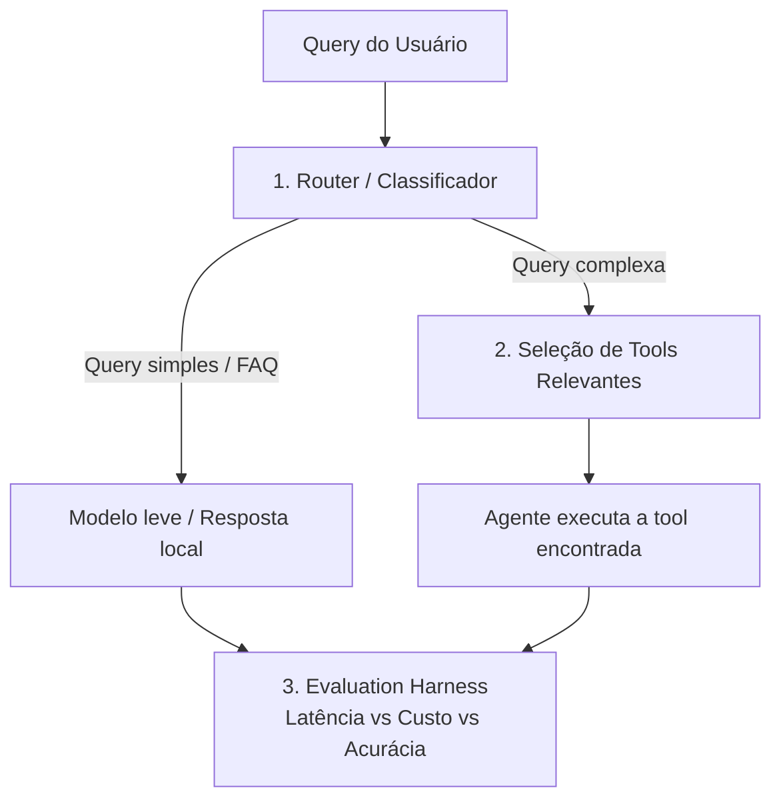

# Case Técnico — Router de Queries & Seleção de Tools

## Contexto

Você está construindo o "cérebro de roteamento" de um agente de atendimento (banco digital
fictício). Antes de qualquer chamada a um LLM caro, o sistema precisa decidir **o caminho mais
barato e rápido possível** para responder cada mensagem do usuário.

Este case tem requisitos claros, mas **a técnica/abordagem é escolha sua** — não há uma única
solução "certa" esperada. Justifique as decisões que tomar.



## O que você precisa implementar

### Pilar 1 — Router (`router.py`)
Um componente que decide, para cada `query`, se ela deve ir para:
- `FAST_PATH`: saudações, FAQ, perguntas genéricas → resposta local (`common/mock_llm.py`).
- `AGENT`: precisa de uma tool específica → vai para o Pilar 2.

Implemente `fit(texts, labels)` e `predict(query) -> RouteResult` (contrato em
`common/interfaces.py`). A técnica é livre. Treine com `data/router_training_data.json`.

### Pilar 2 — Seleção de Tools Relevantes (`retrieval.py`)
O catálogo de tools está em `data/tools_registry.json`. Passar todas as tools no prompt de
um LLM não escala (estoura o contexto, confunde o modelo, aumenta custo e latência).

**Requisito:** `search(query, k=2)` deve retornar as `k` tools mais relevantes do catálogo
para a query, antes de qualquer chamada ao LLM. A estratégia de seleção/ranking é livre —
só precisa ser justificável.

### Pilar 3 — Evaluation Harness (`harness.py`)
A orquestração do pipeline já está pronta. Falta implementar as métricas:
- Acurácia do Router + matriz de confusão.
- Precision@K do retriever (a tool certa estava no top-k?).
- % de economia de custo e de latência do pipeline "inteligente" vs. baseline (mandar tudo
  direto para o LLM caro, com todas as tools no prompt).

## Como rodar

```bash
pip install -r requirements.txt
python -m candidate_starter.run_case
pytest candidate_starter/tests -v
```

## Entregáveis

1. `router.py`, `retrieval.py`, `harness.py` implementados (os testes em `tests/` devem passar).
2. O relatório impresso/gerado por `run_case.py` (salvo em `reports/candidate_report.json`).
3. Um breve comentário (README ou PR) explicando as escolhas técnicas e trade-offs.

---
---

# Descrição

Deixei dividido em duas pastas. Em `entregavel-case-router/` está o entregável do case, com tudo
que foi solicitado. Ele roda sozinho, sem chave de API e sem nenhuma dependência além do
`requirements.txt` original.

Já em [`Treinamento-case-router/`](../Treinamento-case-router/) eu deixei os notebooks, os testes
com personas, os relatórios e tudo que usei para desenvolver. Nada de lá é necessário para avaliar
o case.

```bash
pip install -r requirements.txt
```

```bash
python -m pytest candidate_starter/tests -v
```

```bash
python -m candidate_starter.run_case
```

## Arquitetura

Pensei inicialmente em ter um "orquestrador" logo após a solicitação do usuário, onde ele decidiria
entre chamar a query simples ou a complexa. No entanto, como o objetivo era evitar custo, usar LLM
não era a melhor abordagem no início. Então preferi uma abordagem híbrida, usando ML clássico para
criar um classificador local: termos de frequência e regressão logística, treinando com os 53
exemplos que eu tinha.

Uma escolha pequena que fez diferença: usei n-gramas de **caractere** em vez de palavra. Português
tem muita flexão (fatura/faturas, parcelar/parcelamento) e 53 exemplos é pouco para o modelo
aprender cada variação. N-gramas de caractere pegam o radical sem precisar de stemmer, e de quebra
toleram erro de digitação — o que se mostrou importante depois, quando fui testar com usuários
simulados. O classificador acerta 100% do conjunto de avaliação em cerca de 1 ms.

### A parte difícil não era essa

Quando cheguei no Pilar 2, achei que seria só medir similaridade e pegar as duas melhores. Rodei e
deu 25% de Precision@2. Fui olhar o que estava acontecendo e o catálogo tem uma armadilha
proposital: 285 ferramentas com quase-duplicatas, e para várias mensagens a ferramenta *mais
parecida* não é a certa.

> "Manda o pdf da minha fatura atual" → a busca devolve `enviar_pdf_fatura_atual`,
> mas o esperado é `consultar_fatura`.

A variante longa ganha só porque repete as palavras do cliente. Não é um problema de motor de
busca ruim — é que "mais parecido" e "correto" são coisas diferentes aqui.

O que resolveu foi preferir a ferramenta mais genérica. Primeiro eu fundo duas buscas (caractere e
palavra) usando Reciprocal Rank Fusion, que combina os *rankings* em vez das notas — assim não
preciso normalizar escalas diferentes. Depois aplico uma penalidade proporcional a quão específico
é o nome da ferramenta. Entre duas que atendem à mesma intenção, a mais geral costuma ser a porta
de entrada correta; as longas são refinamentos de um catálogo mal higienizado. Isso levou o
Precision@2 de 45% para 85%, e foi o maior ganho isolado da solução.

Antes de chegar nisso testei duas alternativas que não funcionaram, e prefiro deixar registrado:
BM25 com normalização agressiva de comprimento deu 20%, porque o parâmetro `b` normaliza saturação
de frequência e não especificidade de conceito — ele simplesmente não ataca esse problema. Agrupar
as quase-duplicatas em clusters deu 60%, mas a transitividade encadeia grupos que não deveriam se
juntar e derruba o recall, que é o teto de tudo que vem depois.

## Como eu testei

Os testes automatizados cobrem o código, mas eles usam as mensagens que eu mesmo escolhi. Isso me
incomodava: o conjunto de avaliação tem 30 mensagens bem comportadas, e cliente de banco não
escreve assim. Então montei uma bateria de subagentes com o SDK da OpenAI para atacar a solução.

Cinco personas geraram 150 mensagens novas, cada uma com um jeito diferente de escrever:

| Persona | Como escreve |
|---|---|
| `leigo_idoso` | frases longas, educadas, sem termo técnico |
| `jovem_girias` | abreviação, gíria, sem pontuação |
| `dedos_gordos` | erro de digitação em quase toda palavra |
| `especialista_bancario` | termo formal e correto ("informe de rendimentos", "portabilidade") |
| `caotico` | pedidos misturados, mudança de assunto no meio |

O resultado foi o achado mais útil do projeto inteiro:

| Conjunto | Precision@2 |
|---|---|
| Oficial (30 mensagens do case) | 85% |
| Personas (150 mensagens) | **57,5%** |

Quase 30 pontos de diferença. E o pior caso foi o `leigo_idoso`, com 40% — justamente o perfil que
mais precisa que o atendimento funcione. Nada disso aparecia no conjunto oficial.

Também usei dois subagentes como avaliadores, com o papel de criticar a solução: um olhando
produção (segurança, resiliência, latência) e outro olhando método (viés, vazamento, validade das
métricas). O de método apontou uma coisa que eu não tinha visto: **40% do conjunto de avaliação tem
sobreposição alta com o de treino**, e 3 mensagens são cópias literais. Ou seja, parte do meu 100%
de acurácia era o modelo reconhecendo algo que já tinha visto.

Os relatórios brutos dessas rodadas estão em
[`Treinamento-case-router/App/reports/`](../Treinamento-case-router/App/reports/), para os números
poderem ser conferidos em vez de acreditados.

## Resultados

| | Baseline | Solução |
|---|---|---|
| Acurácia do router | — | 100% |
| Precision@2 do retriever | 25% | 85% |
| Economia de custo | — | 77,8% |

## Onde eu não confio nos meus próprios números

Prefiro apontar isso a deixar você descobrir:

- **A economia de latência de 97,7% compara coisas diferentes.** Do lado inteligente o harness soma
  só router + retrieval; do lado do baseline, soma a chamada de LLM. Com a chamada incluída nos dois
  lados, a economia real é 65,3%. Os dois números estão no relatório.
- **Precision@K só conta as mensagens que o router mandou para o agente.** Um router ruim poderia
  inflar essa métrica escondendo os próprios erros. Por isso incluí um `end_to_end_success_rate`,
  que exige acertar rota **e** ferramenta.
- **n=30 é pouco.** Com esse tamanho, "100% de acurácia" não é estatisticamente conclusivo — reporto
  intervalo de confiança junto. E, pelo vazamento que o avaliador apontou, o número honesto é o das
  18 mensagens sem sobreposição, onde a acurácia se mantém em 100%.
- **57,5% com as personas é o número que eu levaria para uma reunião**, não os 85%. O conjunto
  oficial é mais fácil que a realidade.

## Se quiser ir mais fundo

O raciocínio completo de cada decisão, os bugs que encontrei com as personas e as duas arquiteturas
alternativas que testei depois (um orquestrador por LLM e uma cascata híbrida) estão documentados
em [`Treinamento-case-router/`](../Treinamento-case-router/).