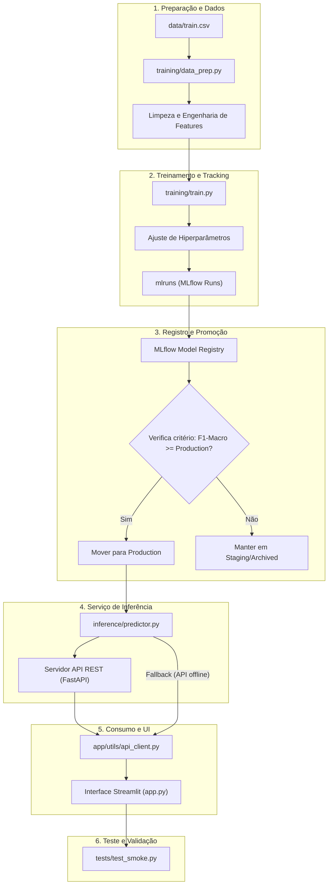

# Ciclo de Vida do Projeto - QuantumFinance

Este documento descreve a organização de arquivos, diretórios e fluxos recomendados para a manutenção e evolução do ciclo de vida (MLOps Lifecycle) do projeto QuantumFinance. Ele serve como um template estrutural e um descritivo de responsabilidades para engenheiros de Machine Learning, engenheiros de dados e desenvolvedores.

---

## 1. Estrutura de Diretórios e Componentes

Abaixo está o esquema de organização dos arquivos e pastas do projeto, detalhando o papel de cada item na sustentabilidade e evolução contínua da aplicação.

```text
quantumfinance_streamlit/
│
├── .gitignore                   # Exclusão de arquivos locais (mlruns, .venv, etc.)
├── requirements.txt             # Dependências de bibliotecas de ML, UI e infraestrutura
├── README.md                    # Instruções gerais de instalação e execução rápida
├── app.py                       # Ponto de entrada (entrypoint) do front-end Streamlit
├── run.sh                       # Script bash para automatizar a inicialização do app
│
├── .streamlit/                  # Configurações do ecossistema Streamlit
│   ├── config.toml              # Definições visuais, de porta e comportamento do Streamlit
│   └── secrets.toml.example     # Exemplo de variáveis de ambiente e chaves da API
│
├── app/                         # Código principal da aplicação front-end
│   ├── components/              # Elementos modulares reutilizáveis de interface
│   │   ├── charts.py            # Componentes visuais para exibição de gauges e métricas
│   │   └── form_builder.py      # Construtor dinâmico de formulários baseado em schema
│   │
│   ├── pages/                   # Telas específicas do aplicativo Streamlit
│   │   ├── 1_predict.py         # Tela de predição individual (formulário detalhado)
│   │   ├── 2_batch.py           # Tela de processamento em lote via upload de CSV
│   │   ├── 3_history.py         # Tela de histórico de consultas realizadas na sessão
│   │   ├── 4_status.py          # Tela de telemetria e versão do modelo em produção
│   │   └── 5_about.py           # Tela informativa sobre o projeto e equipe
│   │
│   └── utils/                   # Módulos auxiliares de lógica do front-end
│       ├── api_client.py        # Cliente HTTP com gerenciamento de fallback para modelo local
│       ├── auth.py              # Gerenciador de logins, controle de JWT e modo demo
│       ├── schema.py            # Definição estrita das 23 features, tipos e limites
│       └── styles.py            # Customização visual avançada da interface (Vanilla CSS)
│
├── training/                    # Pipeline de treinamento e rastreamento de experimentos
│   ├── data_prep.py             # Tratamento de valores ausentes, remoção de ruídos e encodings
│   └── train.py                 # Script de treino, registro no MLflow e promoção de modelos
│
├── inference/                   # Camada de inferência integrada com o registro de modelos
│   └── predictor.py             # Classe Predictor que carrega a versão de produção e executa previsões
│
├── data/                        # Dados estruturados utilizados no projeto
│   ├── train.csv                # Dataset original completo (Kaggle)
│   ├── test.csv                 # Dataset de teste original
│   └── train_sample.csv         # Amostra reduzida para testes de desenvolvimento ágeis
│
├── docs/                        # Documentação técnica e guias do desenvolvedor
│   ├── integration_notes.md     # Notas de integração para a equipe de backend da API
│   ├── api_documentation.md     # Documentação detalhada dos endpoints, payloads e erros da API
│   └── project_lifecycle.md     # Este documento de gerenciamento de ciclo de vida
│
├── tests/                       # Testes automatizados para validação do código
│   └── test_smoke.py            # Testes de fumaça para importações, login, limpeza e inferência
│
└── mlruns/                      # Banco de dados e artefatos local do MLflow (gerado na execução)
```

---

## 2. O Fluxo do Ciclo de Vida (MLOps Pipeline)

A manutenção do modelo de classificação de crédito envolve etapas cíclicas bem definidas. O diagrama abaixo representa o fluxo contínuo de dados e modelos através da estrutura do projeto.



---

## 3. Descrição de Responsabilidades no Ciclo de Vida

### Fase 1: Atualização e Engenharia de Dados (`data/` e `training/data_prep.py`)
* **Ação:** Sempre que novas regras de negócios surgirem ou novos dados forem coletados, as atualizações devem ser implementadas em `data_prep.py`.
* **Função:** Este módulo centraliza a conversão de tipos de dados (como converter `Age` de string com caracteres indesejados para inteiro) e a engenharia de features (como calcular `Credit_History_Age_Months`).
* **Regra de Ciclo de Vida:** O mesmo processamento de limpeza e preenchimento de nulos aplicados no treinamento deve ser garantido na inferência. Por essa razão, `inference/predictor.py` importa e executa `clean_dataframe` diretamente de `training/data_prep.py`.

### Fase 2: Treinamento de Modelos e Rastreamento (`training/train.py` e `mlruns/`)
* **Ação:** Executado periodicamente ou via pipelines de CI/CD para atualizar o modelo de predição.
* **Função:** 
  * Treina múltiplos algoritmos baseados nas opções passadas por argumentos CLI (`random_forest`, `gradient_boosting`, `logistic_regression`).
  * Registra hiperparâmetros, artefatos (como matriz de confusão e o pipeline `ColumnTransformer`) e métricas (`accuracy`, `f1_macro`, etc.) no repositório local `mlruns/`.
* **Regra de Ciclo de Vida:** O MLflow é utilizado localmente para registrar experimentos. O versionamento do modelo e dos encoders é totalmente automatizado nesta etapa.

### Fase 3: Registro e Promoção de Modelos (`MLflow Registry`)
* **Ação:** Executado dentro do script `training/train.py` utilizando o `MlflowClient`.
* **Função:** 
  * Cria uma nova versão sob o nome registrado `credit_score_clf`.
  * Avalia o desempenho do novo modelo contra o modelo atualmente em produção utilizando a métrica `f1_macro`.
  * Caso o novo modelo tenha desempenho superior ou igual, ele realiza a promoção automática para o estágio de `Production`. A versão de produção anterior é rebaixada e movida para `Archived`.

### Fase 4: Inferência e Abstração do Modelo (`inference/predictor.py`)
* **Ação:** Carregado em tempo de execução pela API REST ou pelo front-end no modo de contingência.
* **Função:** 
  * Conecta ao MLflow Model Registry e baixa a versão mais recente do modelo que estiver rotulada no estágio `Production`.
  * Carrega o Label Encoder associado ao modelo que foi armazenado nos artefatos da execução.
  * Expõe métodos utilitários `predict_one` e `predict_batch` que encapsulam a entrada de dados (dicionários python ou DataFrames pandas) e retornam a estrutura padronizada de predição (classes e probabilidades).

### Fase 5: Consumo do Modelo (`app/` e API REST)
* **Ação:** Interface do usuário ou integradores externos acessando o serviço de predição de score.
* **Função:**
  * O app Streamlit consome a API REST através da classe `CreditScoreAPIClient` em `api_client.py`.
  * O schema das features de entrada é mantido de forma rígida em `app/utils/schema.py`, garantindo que qualquer alteração nas features requeridas pelo modelo seja propagada de forma limpa para os componentes dinâmicos do formulário.

### Fase 6: Garantia de Qualidade (`tests/`)
* **Ação:** Executado antes de qualquer deploy em produção ou mesclagem de código (pull requests).
* **Função:** O arquivo `test_smoke.py` utiliza `pytest` para verificar a integridade geral do projeto: se as bibliotecas essenciais estão sendo importadas corretamente, se o parser de limpeza de dados de entrada funciona corretamente sem perder colunas e se as predições de teste no modo demo/local funcionam perfeitamente.

---

## 4. Diretrizes para Alterações e Manutenção

Para adicionar novos campos ou modificar o fluxo atual do projeto, siga as seguintes instruções recomendadas para evitar quebras no ciclo de vida:

1. **Alteração de Features:**
   * Caso queira adicionar ou remover uma variável preditora, primeiro atualize o arquivo [schema.py](file:///C:/Users/stgab/OneDrive/Documentos/GitHub/Grupo_2_atividades/streamlit_quantumfinance/quantumfinance_streamlit/quantumfinance_streamlit/app/utils/schema.py).
   * Em seguida, atualize o tratamento no script de processamento em [data_prep.py](file:///C:/Users/stgab/OneDrive/Documentos/GitHub/Grupo_2_atividades/streamlit_quantumfinance/quantumfinance_streamlit/quantumfinance_streamlit/training/data_prep.py).
   * Por fim, ajuste a tabela correspondente na [api_documentation.md](file:///C:/Users/stgab/OneDrive/Documentos/GitHub/Grupo_2_atividades/streamlit_quantumfinance/quantumfinance_streamlit/quantumfinance_streamlit/docs/api_documentation.md).

2. **Treinamento e Rastreamento Local:**
   * Para iniciar o rastreamento, certifique-se de que a variável de ambiente `MLFLOW_TRACKING_URI` esteja configurada corretamente se você for hospedar o servidor MLflow de forma distribuída. Por padrão, o projeto utilizará um diretório local `./mlruns`.

3. **Validação de Código:**
   * Sempre execute `pytest` no diretório raiz do projeto para validar que nenhuma alteração na lógica de preparação ou na API do cliente quebrou as funcionalidades principais do front-end.
